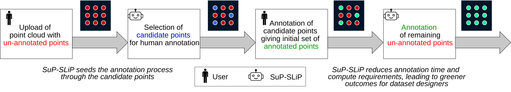
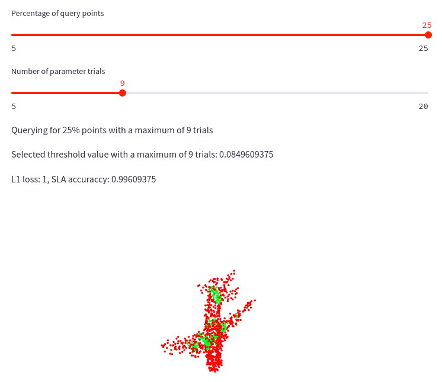

# SuP-SLiP: Subsampled Processing of Large-scale Static LIDAR Point Clouds

This repository contains materials related to our [GeoSearch'24](https://geosearch-workshop.github.io/geosearch2024/) publication, [SuP-SLiP: Subsampled Processing of Large-scale Static LIDAR Point Clouds](https://dl.acm.org/doi/10.1145/3681769.3698585).  

## Abstract
Annotation is a crucial component of point cloud analysis. However, due to the sheer number of points in large-scale static point clouds, it is an expensive and time-consuming process. We address this issue using a novel lightweight approach to reduce the overall annotation time for unlabelled static point clouds in the binary road segmentation task. By leveraging models trained on other point clouds in the same distribution, and radius sampling, our approach determines a small fraction of points for annotation. It automatically labels the remaining points using nearest-neighbor aggregation. We implement this approach in an end-to-end system for mobile laser scanning (MLS) or mobile LiDAR point clouds, SuP-SLiP, i.e., Subsampled Processing of Large-scale Static LIDAR Point Clouds. We validate the robustness of this method through the bit-flipping adversarial attack and account for varying budgets by providing a feature that suggests a custom number of points to annotate for a given point cloud.




## Demo
We release a demo for our Candidate point recommendation module on [Streamlit](https://sup-slpc-demo.streamlit.app/).



[](https://www.youtube.com/watch?v=KVzLXlt8IgA)

## Data
Please refer to [this file](./data/README.md) for more information about downloading the data used for our analysis.

## Installation
To run our experiments, the dependencies listed below must be installed. We recommend using [Kaggle](https://www.kaggle.com/), as all of our experimentation was done on this platform.

```
numpy
scipy
open3d
open3d-ml
torch
trimesh
pandas
```

## Code
Please refer to [this file](./code/README.md) for more information about the code used in our analysis. 


## Contact
Please feel free to reach out, either by [raising an issue](https://github.com/GVCL/SuP-SLiP/issues) or by emailing [jnair@iiitb.ac.in](mailto:jnair@iiitb.ac.in).